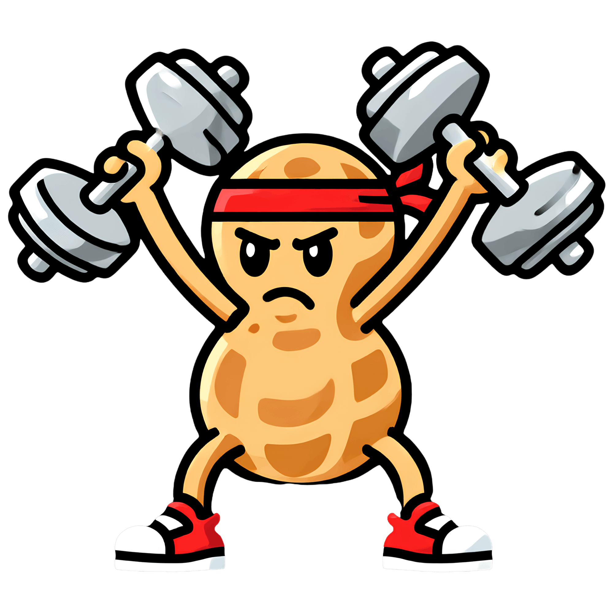

  

<h1 align="center">FitNutt</h1>

  <strong>Stop overcomplicating your fitness. Track your fuel and training with precision.</strong>

  <a href="https://fitnutt.netlify.app">Launch App</a> •
  <a href="#-installation-instructions">Installation</a> •
  <a href="#-features">Features</a>

---

## 🚀 Overview

**FitNutt** is a mobile-first Progressive Web App (PWA) designed for serious lifters. Track your macros, meals, and supplements to ensure you're on track for your next PR. No fluff, just gains.

## ✨ Features

- 📊 **Macro Tracking**: Detailed breakdown of Proteins, Carbs, and Fats with visual progress.
- 🥗 **Meal Logging**: Log your nutrition in seconds to stay on top of your fuel.
- 💊 **Supplement Reminders**: Integrated system to ensure you never miss your creatine or whey.
- 📈 **Progress Cards**: Generate and share beautiful, social-ready "Story Style" cards of your daily stats.
- 🔥 **Pump Levels**: Gamified experience that tracks your consistency and levels you up.

## 📲 Installation Instructions

FitNutt is a PWA (Progressive Web App), giving you a native app experience without the app store clutter.

### **iOS (iPhone/iPad)**

1. Open [fitnutt.netlify.app](https://fitnutt.netlify.app) in **Safari**.
2. Tap the **Share** button (square with up arrow) at the bottom.
3. Scroll down and tap **"Add to Home Screen"**.
4. Confirm by tapping **Add**.

### **Android**

1. Open [fitnutt.netlify.app](https://fitnutt.netlify.app) in **Chrome**.
2. Tap the **Menu** (three dots) in the top right.
3. Tap **"Add to Home screen"** or **"Install app"**.
4. Confirm the installation.

---

Built by 🥜
[fitnutt.netlify.app](https://fitnutt.netlify.app)
