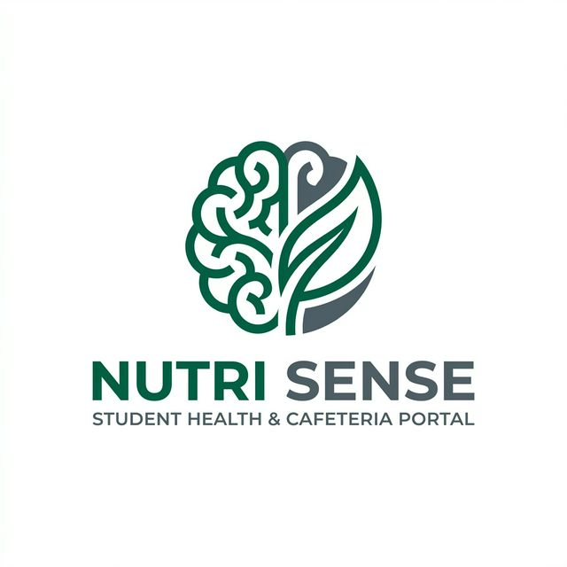

  

<h1 align="center">Nutri Sense</h1>

  <strong>The ultimate student health and cafeteria portal. Manage your wellness and campus funds in one place.</strong>

  <a href="https://smartrasoi.netlify.app">Launch App</a> •
  <a href="#-installation-instructions">Installation</a> •
  <a href="#-features">Features</a>

---

## 🚀 Overview

**Nutri Sense** is a mobile-first student portal designed for the academic ecosystem. Seamlessly track your nutrition, check campus cafeteria menus, and manage your digital health wallet for instant payments.

## ✨ Features

- 🥡 **Cafeteria Integration**: View live menus and place orders directly from the app.
- 💳 **Student Wallet**: Secure digital wallet for quick cafeteria payments and reward points management.
- 📊 **Nutrition Tracking**: Detailed breakdown of your daily macros focused on student wellness.
- 📅 **Academic Planner**: Integrated schedule tracking to manage your classes and meals.
- 📈 **Scholar Levels**: Gamified experience that tracks your healthy habits and rewards academic consistency.

## 📲 Installation Instructions

Nutri Sense is a PWA (Progressive Web App), giving you a native app experience without the app store clutter.

### **iOS (iPhone/iPad)**

1. Open [smartrasoi.netlify.app](https://smartrasoi.netlify.app) in **Safari**.
2. Tap the **Share** button (square with up arrow) at the bottom.
3. Scroll down and tap **"Add to Home Screen"**.
4. Confirm by tapping **Add**.

### **Android**

1. Open [smartrasoi.netlify.app](https://smartrasoi.netlify.app) in **Chrome**.
2. Tap the **Menu** (three dots) in the top right.
3. Tap **"Add to Home screen"** or **"Install app"**.
4. Confirm the installation.

---

Built for Students 🎓
[smartrasoi.netlify.app](https://smartrasoi.netlify.app)
